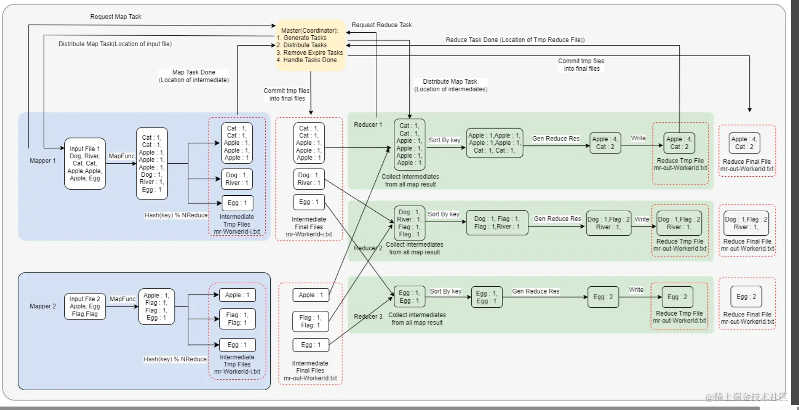
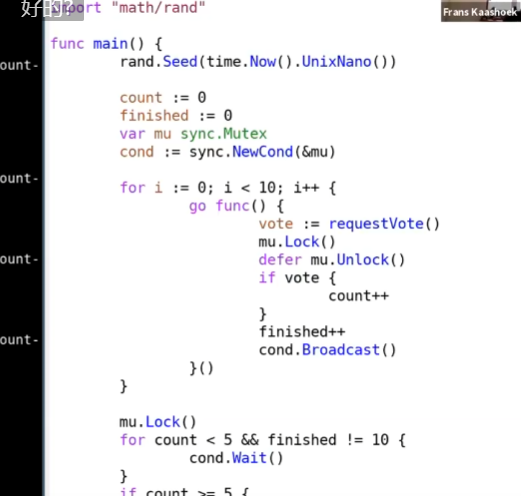
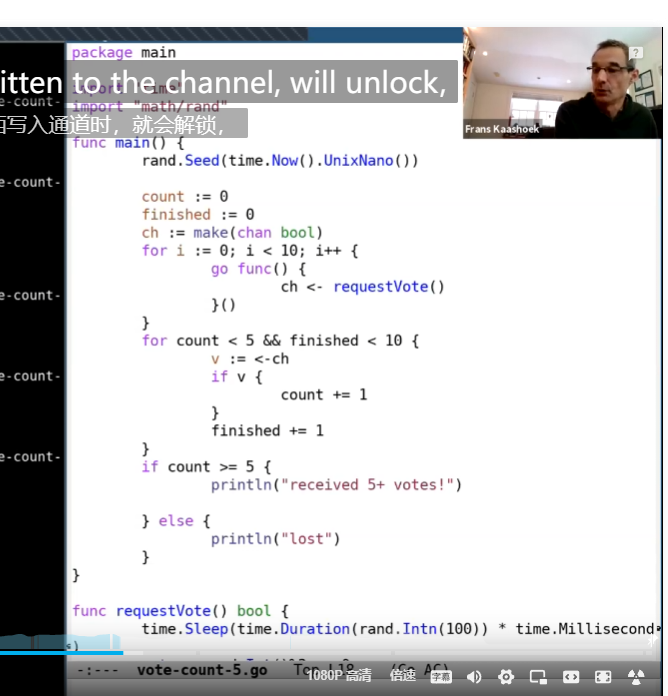
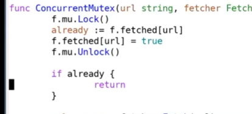
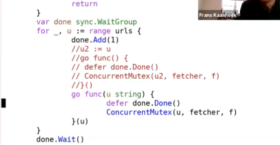
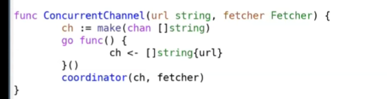
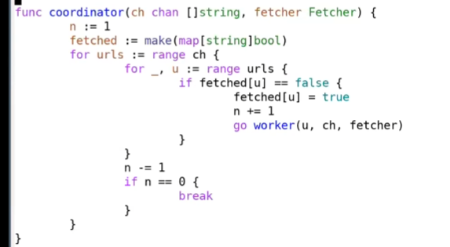

**MapReduce对大规模数据并行化处理的一系列关键性问题提出了解决方案, 包括如何处理输入信息,如何将一个总任务拆分成若干子任务, 如何向集群的机器分发任务, 如何对集群中的机器容错处理等**

## 如何处理输入信息

[MapReuce 详解与复现, 完成 MIT 6.824(6.5840) Lab1 - 掘金 (juejin.cn)](https://juejin.cn/post/7260123819476926501)

### **一个理想的, 完整的使用MapReduce实现word count任务, 执行顺序如下:**

#### Mapper

Master（coordinator）// 协调者， 

mapper向coordinator请求map task， master 给mapper 准备好得map内容

mapper把准备好得内容变成，key-val 键值对, key 为 word, val 恒为1 然后分成NReduce(reducer个数) 份, 拆分规则为对 key 取hash再对NReduce取模

写入location of intermediate, 然后把location告诉master

master 校验 mapper 的请求, 如果请求合法则将 intermediate 临时路径的文件写入最终路径

### Reducer

第一步就是收集各个 mapper 生成的 intermediate

reducer 随后对 收集来的 intermediate 按照 key 进行排序

统计出 key 相同的键值对个数并将其作为新的 val

reducer 将 reduce result 写入临时路径, 并将临时路径告知给master, 表示 reduce task 任务完成

master 校验 reducer 的请求, 如果请求合法则将 reduce task 临时路径的文件写入最终路径， 完成

#### 核心思想 

根据输入生成 intermediate, mapper 告知 master intermediate 位置, master 告诉 reducer intermediate 位置, 由 reducer 自行去 处理 intermediate 。

#### 细节

对intermediate 和 reduce 结果文件进行分批次处理, 划分出临时路径和最终路径，中间要通过master的校验

#### 关键

- worker不做区分： （区分的话效率低下，
-  worker 到底是  mapper 还是 reducer, 去决定当前 task 的状态。若 master 返回的是 map task, 则这个 worker 就是一个 mapper。 若 master 返回的是 reduce task, 则这个 worker 就是一个 reducer。 只有当全部 map task 完成以后, master 才会生成 reduce task。mapper 或者 reducer。 //图中的请求就没有类型了，只要有空求发出请求，至于得到的事reduce task还是mapper task全看master
- 数据竞争 //多个worker请求时候

## Go

避免Race condition 访问临界资源

实现 Coordination， 各个协程之间的顺序

防止  DeadLock， 最常见的就是 超channel里面加一个元素，但是没有进程去读取

- channel //公用内存使用
- lock+condition variable //分享内存使用 （共用一个key value service）

main函数结束，会清除所有的channel

如何判断lock时候并发有效

WaitGroup- 》 跟踪有多少个正在活动的进程，什么时候可以停止

Channel版本 // coordinator和worker

无共享，所以使用Channel

range去拿取所有的

Channel， 装满没有消费会阻塞，消费没有也会阻塞

## RPC

RPC的目的是让远程调用向local调用一样

失败情况：至少一次，正好一次，最多一次（RPC是最多一次）
